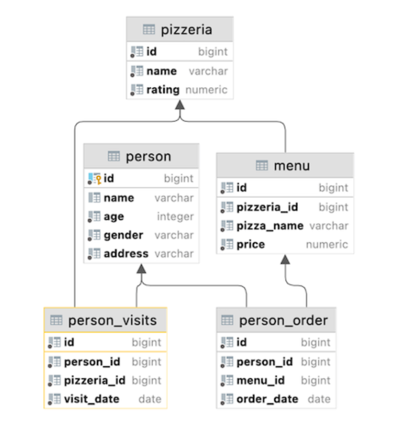

# SQL Bootcamp

## Содержание

1. [О проекте](#о-проекте)
2. [Задания](#задания)

## О проекте

В данном учебном проекте «Школы 21» требовалось выполнить 12 заданий (10 индивидуальных и 2 групповых), направленных на освоение языка SQL. Основной темой индивидуальных заданий была работа с информацией о пиццериях: их меню, ценах, количестве заказов и посещений, а также характеристиках клиентов (город проживания, возраст, пол). Для этого использовалась единая модель базы данных (скрипт для загрузки прилагается к каждому дню в папке **materials**). В первых четырех днях модель оставалась неизменной, а затем в скрипт добавлялись новые данные, которые также можно найти в **materials** по соответствующим дням. Доступ к базе данных осуществлялся через кластер PostgreSQL, и для работы была выбрана IDE [DataGrip](https://www.jetbrains.com/ru-ru/datagrip/) от JetBrains. В каждом дне действовали свои правила по доступности определённых SQL-конструкций, опций и типов данных.

*Модель базы данных индивидуальных заданий*

## Задания

1. [Реляционная модель данных и SQL](https://github.com/Shyrasya/SQL-Bootcamp/tree/main/SQL_beginner.Day00). Знакомство с работой реляционной модели, извлечение необходимых данных с помощью базовых SQL-конструкций;

2. [Множества и JOIN](https://github.com/Shyrasya/SQL-Bootcamp/tree/main/SQL_beginner.Day01). Получение необходимых данных на основе конструкций множеств и простых JOIN;

3. [Подробнее о JOIN](https://github.com/Shyrasya/SQL-Bootcamp/tree/main/SQL_beginner.Day02). Работа с различными структурами JOIN;

4. [Язык DML](https://github.com/Shyrasya/SQL-Bootcamp/tree/main/SQL_beginner.Day03). Дальнейшее изучение JOIN и внесение изменений в данные на основе языка DML;

5. [Снапшоты и виртуальные таблицы](https://github.com/Shyrasya/SQL-Bootcamp/tree/main/SQL_beginner.Day04). Виртуальное представление и физический снимок данных;

6. [Проблема путешествующего коммивояжера](https://github.com/Shyrasya/SQL-Bootcamp/tree/main/SQL_beginner.Team_00/src). Групповой проект - решение задачи о путешествующем между городами продавце с помощью SQL;

7. [Индексы баз данных](https://github.com/Shyrasya/SQL-Bootcamp/tree/main/SQL_beginner.Day05). Создание индексов для ускорения поиска данных;

8. [Таблица для скидок](https://github.com/Shyrasya/SQL-Bootcamp/tree/main/SQL_beginner.Day06). Добавление таблицы с персональными скидками и настройка ограничений;

9. [Агрегирование](https://github.com/Shyrasya/SQL-Bootcamp/tree/main/SQL_beginner.Day07). 
Агрегирование посещений, заказов, рейтингов и стоимости с условиями и сортировкой для аналитики;

10. [Транзакции и уровни изоляции](https://github.com/Shyrasya/SQL-Bootcamp/tree/main/SQL_beginner.Day08). 
Параллельные транзакции в PostgreSQL для демонстрации аномалий изоляции, фантомных и неповторяемых чтений, моделирование тупиковой ситуации;

11. [Триггеры](https://github.com/Shyrasya/SQL-Bootcamp/tree/main/SQL_beginner.Day09). Реализация триггеров для аудита изменений;

12. [Хранилище данных](https://github.com/Shyrasya/SQL-Bootcamp/tree/main/SQL_beginner.Team01/src). Групповой проект, в котором была произведена агрегация балансов и конверсия валют с учетом исторических курсов.

