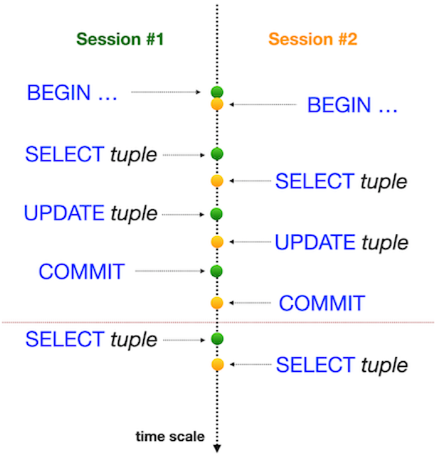
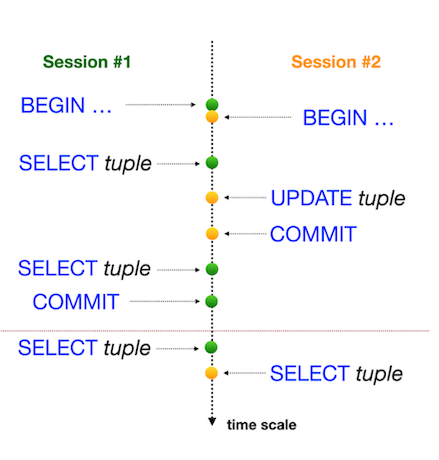
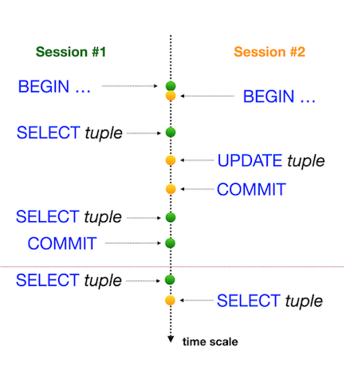
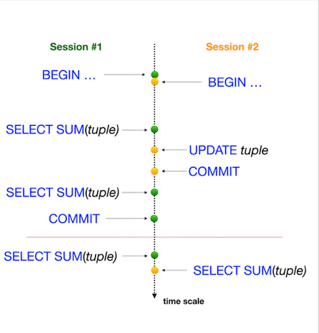
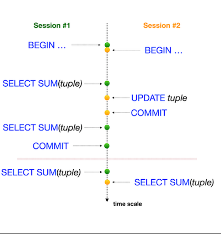
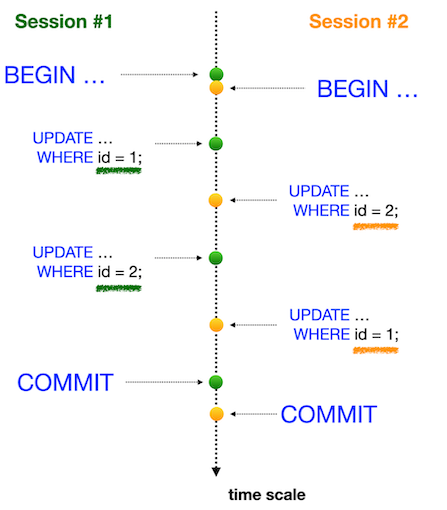

# Day08

Для этого задания использовалась командная строка "PostgreSQL" (psql). Необходимо было открыть две параллельные сессии в командной строке и выполнять различные последовательности действий для демонстрации работы уровней изоляции. Прикреплены скриншоты вывода psql для каждой сессии заданий. В этом дне используется обновленная база данных, основанная на 7-13 заданиях 3 дня и 7 задании 4 дня, которая прикреплена в папке materials.

## О заданиях

1. [Exercise 00](https://github.com/Shyrasya/SQL-Bootcamp/tree/main/SQL_beginner.Day08/src/ex00). Произведенные действия:
	* Сессия #1 - обновление рейтинга для "Pizza Hut" до 5 баллов в режиме транзакции. Изменения видны в сеансе #1;
	* Сессия #2 - изменения в сессии #2 не видны;
	* Сессия #1 - публикация изменений для всех параллельных сессий;
	* Сессия #2 - видны изменения в сессии.
Один и тот же запрос дает разные результаты, потому что первый запрос был запущен до публикации в сессии #1, а второй - после завершения сессии #1;

2. [Exercise 01](https://github.com/Shyrasya/SQL-Bootcamp/tree/main/SQL_beginner.Day08/src/ex01) - реализация аномалии потерянных обновлений ("Lost Update Anomaly"). Установлен стандартный уровень изоляции (для проверки прописывали **"SHOW TRANSACTION ISOLATION LEVEL"** - результат "read committed"). Проверялся рейтинг "Pizza Hut" в режиме транзакции для обеих сессий, выполнялся **"UPDATE"** рейтинга до значения 4 в сессии #1 и **"UPDATE"** рейтинга до значения 3,6 в сессии #2 (в том же порядке, что и на рисунке ниже);
	

	

	*"Аномалия потерянных обновлений"*
	

3. [Exercise 02](https://github.com/Shyrasya/SQL-Bootcamp/tree/main/SQL_beginner.Day08/src/ex02) - реализация аномалии потерянных обновлений под уровнем изоляции "REPEATABLE READ". Запрос задания совпадает с Exercise 01;

4. [Exercise 03](https://github.com/Shyrasya/SQL-Bootcamp/tree/main/SQL_beginner.Day08/src/ex03) - реализация известных паттернов базы данных «Неповторяемые чтения» (Non-Repeatable Reads) под уровнем изоляции "READ COMMITTED". Проверялся рейтинг "Pizza Hut" в режиме транзакции для Сессии #1, после выполнялся **"UPDATE"** рейтинга до значения 3.6 в Сессии #2 (в том же порядке, что и на рисунке ниже);
	

	

	*""Неповторяемые чтения" под режимом транзации "READ COMMITTED""*
	

5. [Exercise 04](https://github.com/Shyrasya/SQL-Bootcamp/tree/main/SQL_beginner.Day08/src/ex04) - реализация известных паттернов базы данных «Неповторяемые чтения» (Non-Repeatable Reads) под уровнем изоляции "SERIALIZABLE". Проверялся рейтинг "Pizza Hut" в режиме транзакции для Сессии #1, после выполнялся **"UPDATE"** рейтинга до значения 3.0 в Сессии #2 (в том же порядке, что и на рисунке ниже);

	

	

	*""Неповторяемые чтения" под режимом транзации "SERIALIZABLE""*
	

6. [Exercise 05](https://github.com/Shyrasya/SQL-Bootcamp/tree/main/SQL_beginner.Day08/src/ex05) - реализация известных паттернов базы данных «Фантомные чтения» (Phantom Reads) под уровнем изоляции "READ COMMITTED". Суммировались все рейтинги со всех пиццерий в режиме транзакции для Сессии #1, после выполнялся **"UPDATE"** рейтинга "Pizza Hut" до значения 1 в Сессии #2 (в том же порядке, что и на рисунке ниже);

	

	

	*""Фантомные чтения" под режимом транзации "READ COMMITTED""*
	

7. [Exercise 06](https://github.com/Shyrasya/SQL-Bootcamp/tree/main/SQL_beginner.Day08/src/ex06) - реализация «Фантомных чтений» (Phantom Reads) под уровнем изоляции "REPEATABLE READ". Суммировались все рейтинги со всех пиццерий в режиме транзакции для Сессии #1, после выполнялся **"UPDATE"** рейтинга "Pizza Hut" до значения 5 в Сессии #2 (в том же порядке, что и на рисунке ниже);

	

	

	*""Фантомные чтения" под режимом транзации "REPEATABLE READ""*
	

8. [Exercise 07](https://github.com/Shyrasya/SQL-Bootcamp/tree/main/SQL_beginner.Day08/src/ex07) - реализация тупиковой ситуации (deadlock situation) между параллельными сессиями. Использовался любой SQL-запрос с любым уровнем изоляции для таблицы "pizzeria".

	

	

	*"Тупиковая ситуация"*
	

