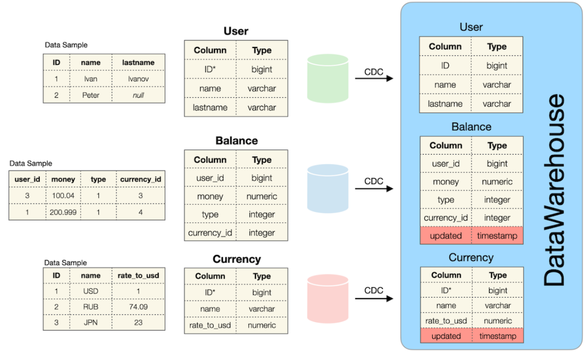
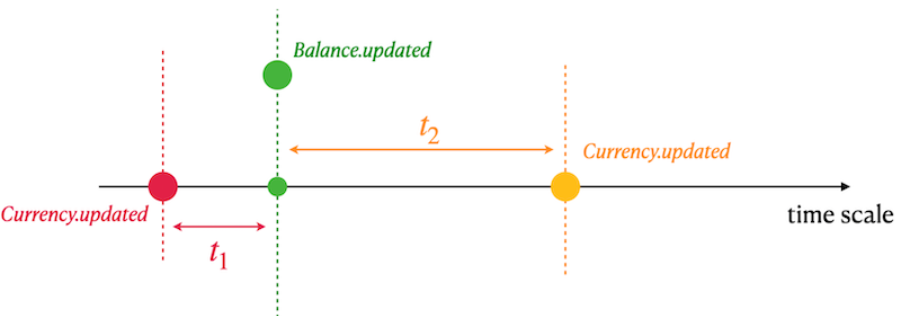

# Team 01

Знакомство с Data Warehouse (DWH) и создание первого ETL-процесса. Обработка данных с аномалиями для агрегации балансов по пользователям и конверсии валют с учетом истории курсов в ближайших прошлых и будущих записях. Участники данного группового задания: [lesleyle](https://github.com/IvanVito) - Exercise 00, [lemongrb](https://github.com/Shyrasya) - Exercise 01.

## О заданиях

1. [Exercise 00](https://github.com/Shyrasya/SQL-Bootcamp/tree/main/SQL_beginner.Team01/src/ex00) На картинке представлен источник данных и первый логический слой данных (ODS - Operational Data Store) в DWH:
	<div align=center>

	

	</div>

	Зеленая, красная и синяя базы данных являются независимыми источниками данных и соответствуют шаблону микросервиса - высок риск возникновения аномалий в данных:
	* В таблицах отсутствует согласованность данных: есть "User", но нет строк в таблице "Balance", или наоборот, есть "Balance", но нет строк в таблице "User". Такая же ситуация существует между таблицами "Currency" и "Balance" (между ними нет явных внешних ключей);
	* Возможны NULL-значения для "Name" и "Lastname" в таблице "User";
	* Все таблицы работают под OLTP (OnLine Transactional Processing) SQL-трафиком. Это означает, что в каждый момент времени существует текущее состояние данных, исторические изменения для каждой таблицы не сохраняются.
	
	Эти 3 перечисленные таблицы являются источниками данных для таблиц с аналогичными моделями данных в области DWH.

	Определение таблицы "User":

	| Название столбца | Описание |
	| ------ | ------ |
	| ID | Первичный ключ |
	| name | Имя пользователя |
	| lastname | Фамилия пользователя |

	Определение таблицы "Currency":

	| Название столбца | Описание |
	| ------ | ------ |
	| ID | Имитированный первичный ключ |
	| name | Название валюты|
	| rate_to_usd | Отношение к валюте USD |
	| updated | Временная метка события из исходной базы данных |

	Имитированный первичный ключ означает, что есть дубликаты с одинаковым идентификатором, потому что был добавлен новый обновленный атрибут, который меняет реляционную модель на временную. 

	Определение таблицы "Balance":

	| Название столбца | Описание |
	| ------ | ------ |
	| user_id | "Виртуальный внешний ключ" к таблице "User" из другого источника |
	| money | Количество денег |
	| type | Тип баланса |
	| currency_id | "Виртуальный внешний ключ" к таблице "Currency" из другого источника |
	| updated | Временная метка события из исходной базы данных |

	  Все таблицы в DWH наследуют все аномалии из исходных таблиц:
	* Таблицы не находятся в состоянии согласованности данных;
	* Возможны значения NULL для "Name" и "Lastname" в таблице "User".

	По заданию был написан запрос, который возвращает общий объем (сумму всех денег) транзакций с баланса пользователя, агрегированный по пользователю и типу баланса. Обработаны все данные, включая данные с аномалиями. Ниже приведена таблица столбцов результатов и соответствующая формула расчета. Результирующая таблица отсортирована по имени пользователя по убыванию, по фамилии пользователя и балансу по возрастанию. 

	| Выходной столбец | Формула на псевдокоде |
	| ------ | ------ |
	| name | источник: user.name, если user.name равен NULL, то возвращается неопределенное значение |
	| lastname | источник: user.lastname, если user.last name равен NULL, то возвращается неопределенное значение |
	| type | источник: balance.type | 
	| volume | источник: balance.money, суммирование всех денежных "движений" | 
	| currency_name | источник: currency.name, если currency.name равен NULL, то возвращается неопределенное значение | 
	| last_rate_to_usd | источник: currency.rate_to_usd, берется последний currency.rate_to_usd для соответствующей валюты, если currency.rate_to_usd равен NULL, то возвращается 1 | 
	| total_volume_in_usd | источник: volume, last_rate_to_usd, выполняется умножение между объемом и last_rate_to_usd |

1. [Exercise 01](https://github.com/Shyrasya/SQL-Bootcamp/tree/main/SQL_beginner.Team01/src/ex01) Для начала подготовимся к заданию - выполняется вставка:
	```
	INSERT INTO currency values (100, 'EUR', 0.85, '2022-01-01 13:29'); insert into currency values (100, 'EUR', 0.79, '2022-01-08 13:29');
	```
	Необходимо было написать SQL-запрос, который возвращает всех пользователей, все балансовые транзакции (в этой задаче не учитывались валюты, у которых нет ключа в таблице "Currency") с названием валюты и рассчитанным значением валюты в USD на следующий день. Ниже приведена таблица столбцов результатов и соответствующая формула расчета. 	Итоговый результат сортируется по имени пользователя в порядке убывания и затем по имени пользователя и названию валюты в порядке возрастания.

	| Выходной столбец | Формула на псевдокоде |
	| ------ | ------ |
	| name | источник: user.name, если user.name равен NULL, то возвращается неопределенное значение |
	| lastname | источник: user.lastname, если user.lastname то возвращается неопределенное значение |
	| currency_name | источник: currency.name | 
	| currency_in_usd | источники: currency.rate_to_usd, currency.updated, balance.updated. Расчитывается, исходя по картинке ниже|

	<div align=center>

	

	</div>

	* Необходимо найти ближайший курс_к_usd валюты в прошлом (t1);
	* Если t1 пуст (означает отсутствие курсов в прошлом), то находится ближайший курс_к_usd валюты в будущем (t2);
	* Используется курс t1 или t2 для расчета валюты в формате USD.


