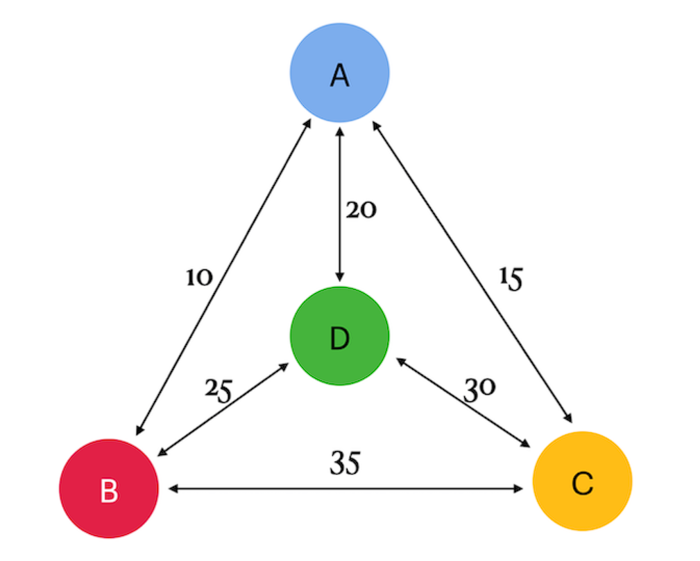

# Team 00

Решение небольшой задачи "Traveling Salesman Problem" (TSP), в которой необходимо найти самый дешевый способ посетить все города. Участники данного группового задания: [lesleyle](https://github.com/IvanVito), [lemongrb](https://github.com/Shyrasya).

## О заданиях

1. [Exercise 00](https://github.com/Shyrasya/SQL-Bootcamp/tree/main/SQL_beginner.Team_00/src/ex00) - 
создание таблицы с именнованными узлами со структурой {точка1, точка2, стоимость} с данными, взятыми из картинки ниже. На ней представлены 4 города (a, b, c, d) и линии между ними со стоимостью поездки. 

	

	

	*Граф с 4 городами*
	

	SQL-запрос возвращает выборку со всеми турами-поездками с минимальной стоимостью поездки, если путешествие начинается и заканчивается из города a. Данные отсортированы по "total_cost" и по турам. В задании использован рекурсивный запрос;

2. [Exercise 01](https://github.com/Shyrasya/SQL-Bootcamp/tree/main/SQL_beginner.Team_00/src/ex01) - добавление дополнительных строк к Exercise 00 с самой дорогой поездкой. Данные отсортированы по итоговой стоимости и по турам.

